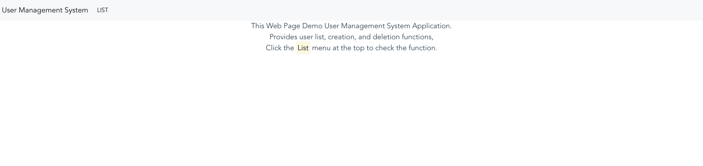

# 데모 사용자 관리 시스템 frontend
사용자 관리 시스템 어플리케이션은 Vue를 사용하여 구축된 SPA application 입니다.
nodejs 환경에서 작동하며 npm 명령어로 실행 할 수 있습니다.

## 사전준비
node v12.x

### 의존성 다운로드
```
npm install
```

### 백엔드 주소 설정
vue.config.js 파일 에서 백엔드 주소를 확인하여 적절히 변경합니다.

### 실행 방법
```
npm run serve
```

정상적으로 실행되었다면 http://localhost:3000 에서 아래의 화면을 확인 할 수 있습니다.



